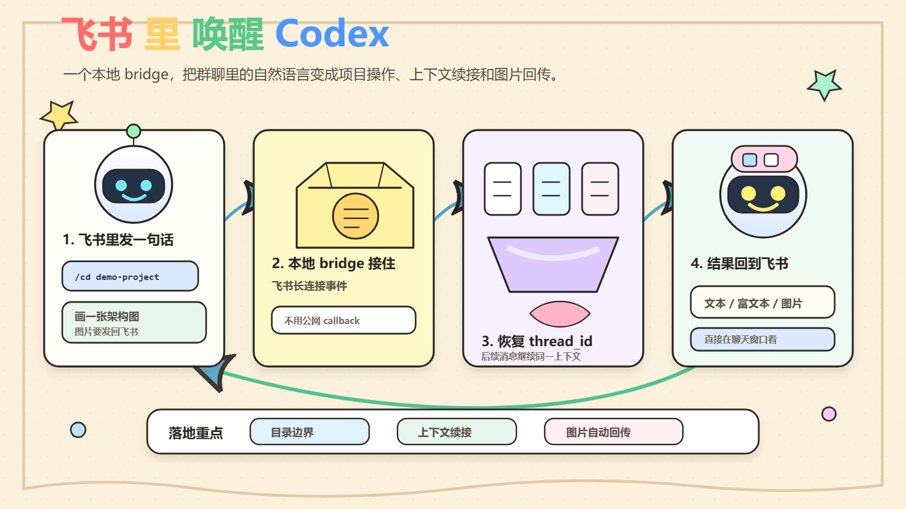
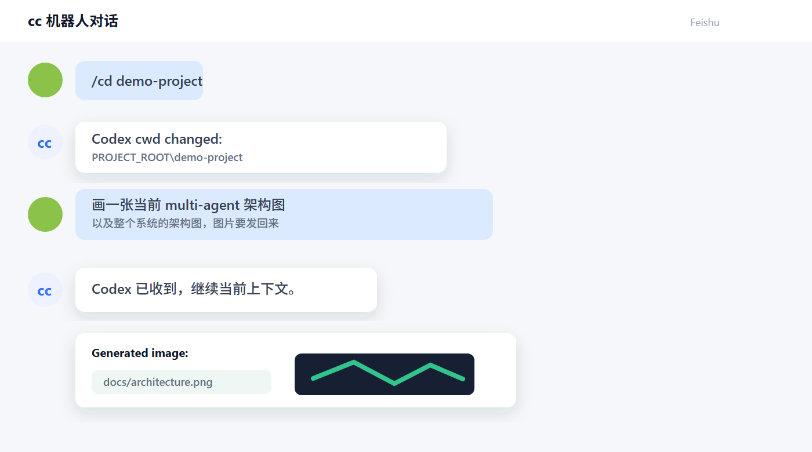
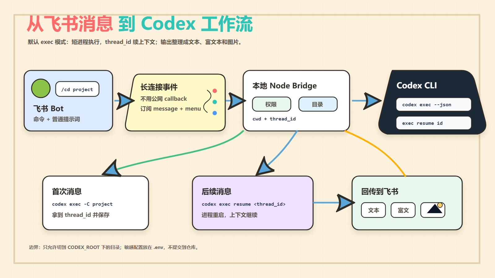
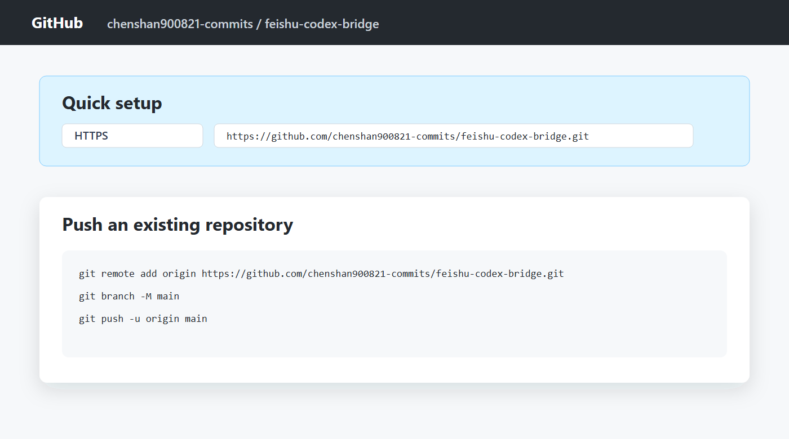

# 我把 Codex CLI 接进了飞书：新人也能用聊天窗口调 AI 写代码



项目地址：

```text
https://github.com/chenshan900821-commits/feishu-codex-bridge
```

过去一段时间，我一直在用 Codex IDE 做项目。IDE 很适合坐在电脑前持续开发，但我遇到一个很具体的问题：很多时候我不在 IDE 前，只是在飞书里讨论需求、看结果、让 AI 帮我查项目结构。于是我做了一个小工具：把飞书机器人接到本地 Codex CLI。

最后的效果很直接：

在飞书里给机器人发消息，它会把消息转给本机 Codex CLI；Codex 读项目、执行命令、生成结果；结果再回到飞书。如果 Codex 生成了图片，也会自动作为飞书图片消息发回来。

这篇文章不讲大而全的平台，只讲一个新人也能理解、能部署、能改造的小实现。

先看一下实际使用时的样子。下面这张图是根据真实飞书对话重绘的截图，隐去了头像和敏感信息，但保留了真实交互路径：先 `/cd` 到项目目录，再让 Codex 画图，最后图片回传到飞书。



## 为什么不是直接做一个后端服务

一开始我也以为要做一个公网后端，接飞书回调，再转给 Codex。但飞书自建应用支持长连接事件模式，这就省掉了公网回调地址。

整个链路变成这样：

```text
飞书机器人
  -> 飞书长连接事件
  -> 本地 Node.js bridge
  -> Codex CLI
  -> 本地 Node.js bridge
  -> 飞书消息
```

这件事的关键点是：桥接程序跑在本机。

本机已经有项目目录、本机已经登录 Codex CLI、本机也能运行 npm、git、测试命令。飞书只是一个入口，不需要把代码上传到什么中间服务。

下面是整个链路的架构图：



## 核心设计：短进程，但长上下文

最容易踩坑的是 Codex CLI 的运行方式。

如果用 `codex exec`，每条消息都会启动一个短生命周期的 Codex 进程。第一次看起来会让人不安：这是不是每次都重新开始了？上下文是不是丢了？

答案是：进程会重启，但上下文不用丢。

Codex CLI 会返回一个 `thread_id`。桥接程序把它保存起来，下一条消息用：

```bash
codex exec resume <thread_id>
```

所以实现上是“每条消息一个短进程”，体验上是“同一个 Codex 会话持续对话”。

我最后选择默认使用 `exec` 模式，而不是常驻的终端 `pty` 模式。原因很现实：机器人需要稳定拿到最终回复、命令事件、失败状态和图片输出。`codex exec --json` 会输出结构化 JSONL，比解析一个终端 UI 靠谱。

## 飞书里有哪些命令

我给机器人加了一组很小但够用的命令：

```text
/help       查看帮助
/pwd        查看当前 Codex 工作目录
/dirs       查看子目录
/cd <path>  切换项目目录
/status     查看当前是否在处理，以及 thread_id
/new        开新上下文
/stop       停止当前 Codex 进程
/images     手动发送当前项目里的最近图片
```

普通文本就会直接发给 Codex。

比如：

```text
/cd demo-project
帮我看一下这个项目的 multi-agent 架构，并画一张图
```

如果 Codex 在项目目录里生成了 `png`、`jpg`、`webp` 之类的图片，桥接程序会自动上传到飞书，直接展示出来。

我也把代码放到了个人 GitHub 仓库里，注意不是公司组织：



仓库地址：

```text
https://github.com/chenshan900821-commits/feishu-codex-bridge
```

## 我做了哪些工程化处理

这个工具看起来很小，但要真正好用，需要处理很多边角。

第一，目录边界。

配置里有一个 `CODEX_ROOT`，机器人只能把 Codex 切到这个目录下面。这样 `/cd` 不会随便跑到系统其他目录。

第二，权限控制。

飞书消息里可以拿到 `open_id`、`user_id`、`chat_id`。实际使用时不要开全员访问，而是把可信用户或群聊加入 allow-list。

第三，长任务反馈。

有些 Codex 任务会跑几分钟。桥接程序会定时发“还在处理”的心跳，但不会把每条 shell 命令都刷到飞书里。命令噪音默认隐藏，只在失败时提示。

第四，富文本展示。

Codex 回复长段落、列表、代码块时，普通文本在飞书里可读性很差。所以桥接程序会把长回复拆成飞书 post 消息，尽量保留段落和代码格式。

第五，图片回传。

每次 Codex 执行前，程序会扫描当前目录的图片快照；执行后再扫描一次。新生成或被修改的图片会通过飞书图片接口上传，再发回聊天窗口。

## 部署方式

项目是一个 Node.js 小程序，Windows 和 macOS 都可以跑。

核心环境：

```text
Node.js >= 20
Codex CLI
Feishu 自建应用
```

安装后创建 `.env`：

```env
FEISHU_APP_ID=cli_xxx
FEISHU_APP_SECRET=xxx
FEISHU_ALLOW_ALL=false
CODEX_ROOT=/absolute/path/to/projects
CODEX_CWD=/absolute/path/to/projects
CODEX_TRANSPORT=exec
```

Windows 的路径可以写成：

```env
CODEX_ROOT=D:\Projects
CODEX_CWD=D:\Projects
```

macOS 的路径类似：

```env
CODEX_ROOT=/Users/you/Projects
CODEX_CWD=/Users/you/Projects
```

然后验证：

```bash
npm run check
npm run doctor
```

启动：

```bash
npm start
```

如果要后台运行，Windows 用：

```powershell
.\scripts\start-bridge.ps1
```

macOS 用：

```bash
bash scripts/start-bridge.sh
```

完整部署文档在仓库里：

```text
docs/DEPLOY.md
```

## 给 agent 读的部署说明

我专门加了一个 `AGENTS.md`。

这个文件不是给人看的长教程，而是给后续 AI agent 看的操作契约。里面写清楚：

- 不要提交 `.env`
- 不要打印密钥
- 修改后跑什么检查
- Windows 怎么启动
- macOS 怎么启动
- 如何确认飞书机器人已经能工作

这类文档很重要。因为我们后面很可能不是自己手动维护，而是让另一个 agent 接手升级、部署、排错。给 agent 的文档越明确，它越不容易误操作。

## 这个小工具适合谁

它不适合做成大型 SaaS，也不应该让陌生人随便访问。

它适合这些场景：

- 你已经在本机用 Codex CLI 或 Codex IDE 开发项目
- 你希望在飞书里快速让 Codex 看项目、跑命令、总结结果
- 你有一个小团队，想把“AI 看代码”的入口放进群聊
- 你希望生成的图、文档、分析结果能直接回到飞书

新人也可以从这个项目里学到几件很实用的事：

- 怎么接飞书长连接事件
- 怎么用本地 bridge 包装 CLI 工具
- 怎么把一次性 CLI 进程做成连续上下文体验
- 怎么做基本的目录安全边界
- 怎么给人和 agent 分别写部署文档

## 最后

这个实现没有炫技，反而刻意保持简单。

一个 Node.js 进程，一个 Feishu 长连接，一个 Codex CLI，一份 `.env`。真正有价值的是把它们接在一起后，日常工作入口变短了：你不用打开 IDE，也能在飞书里让 Codex 读项目、跑分析、产出结果。

如果你已经在用 Codex CLI，这个 bridge 是一个很容易改造成自己团队工具的起点。

## 公众号配图说明

如果你要直接发公众号，可以使用本文引用的这些图片：

```text
docs/assets/generated/hero-bridge.png
docs/assets/generated/architecture-flow.png
docs/assets/screenshots/feishu-usage-redraw.png
docs/assets/screenshots/github-repo-redraw.png
```

其中两张截图是基于真实操作路径做的隐私安全重绘版。正式发布时，如果你希望更强的“现场感”，可以把真实飞书截图另存后替换同名 PNG，正文不用改。SVG 源文件也保留在同目录，后续要改文案或尺寸可以继续编辑。
